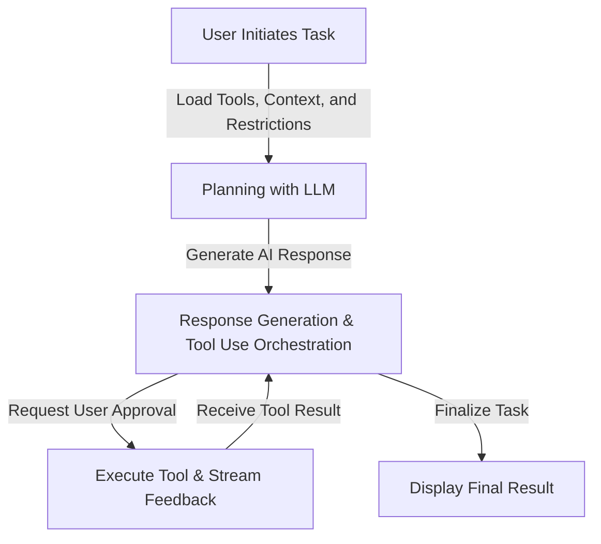
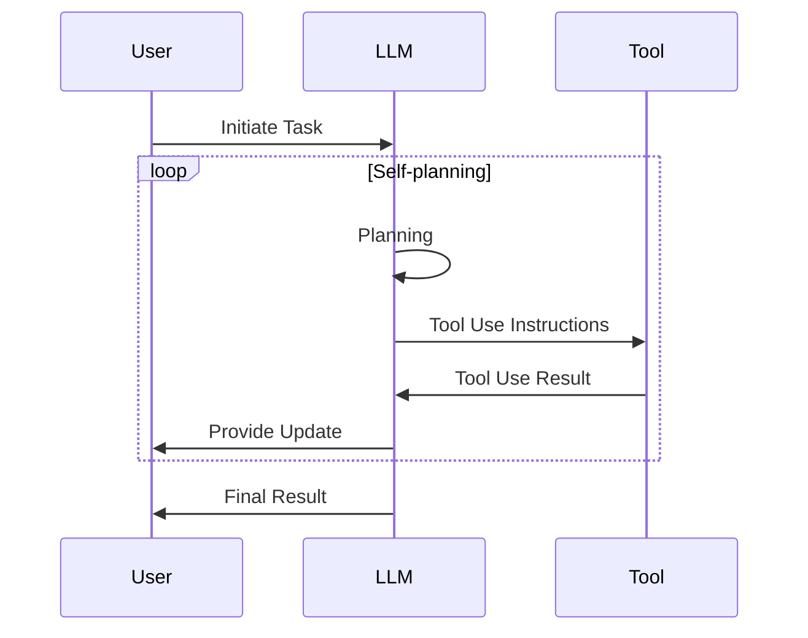

# Understanding the Agent Flow in a VS Code Extension: A Deep Dive into Cline

## Introduction

Intelligent agents like **Cursor Composer** and **WindSurf Cascade** are revolutionizing the in-IDE AI-assisted development landscape by automating complex tasks and enhancing developer productivity. However, leveraging these agents effectively requires overcoming significant challenges:

- **Domain Knowledge and Understanding**: These agents necessitate intricate domain knowledge and a nuanced understanding to operate effectively within specialized contexts.  
- **Testing and Interpretability**: Limited testing capabilities and interpretability complicate the development process. When issues arise, pinpointing the root cause can be difficult, given the black-box nature of many AI models.  
- **Pitfalls and Loops**: A single agent can fall into repetitive loops—such as debugging a coding error or retrying unsuccessful web searches—without considering the broader workflow, hindering smooth task progression.  
- **Steering and Rule Enforcement**: Enforcing rules or guiding an agent’s decision-making can be frustrating if the agent doesn’t readily accept external constraints or lacks transparent decision logic.

In our experiment, we customized the open-source **Cline** project to create a specialized Financial Advisory Agent. This process exposed key pain points and yielded valuable insights into optimizing agent performance. Below, we discuss our technical journey, the solutions we implemented, and the lessons learned while enhancing Cline for this specialized use case.

---

## Agent Flow Overview

### How the Flow Works

The agent flow within our VS Code extension is orchestrated by the `Cline` class, bridging interactions among the user, the Large Language Model (LLM), and the system’s suite of integrated tools. This workflow follows a continuous loop, as illustrated in Figure 1:


**Figure 1**: High-level flowchart of the agent process within the VS Code extension.

1. **Task Start**  
   The user initiates a task through the extension interface. The `Cline` class captures this input and initializes the environment with the necessary tools, contextual data, and constraints.  
2. **Planning with LLM**  
   The LLM receives task details from `Cline` and devises a strategic plan. The plan lists required tools and outlines the steps to achieve the end goal.  
3. **Response Generation & Tool Use Orchestration**  
   Serving as the core of the run loop, the LLM produces a detailed response that dictates tool usage and step-by-step execution.  
4. **User Approval**  
   (If not already pre-approved) The agent verifies user acceptance of the proposed plan. This step ensures alignment with user expectations.  
5. **Executing Tools and Streaming Results**  
   Once approved, tools are executed. They stream real-time feedback to the LLM, which uses this data to guide subsequent decisions.  
6. **Result Assessment**  
   The LLM analyzes incoming feedback to check if additional steps are needed. This cycle repeats until completion criteria are satisfied.  
7. **Task Completion**  
   Upon fulfilling all objectives, the agent concludes the process and delivers aggregated results to the user.

### Tool Use

Each tool is invoked through a structured XML-style syntax, promoting consistency and ease of parsing. Tools fulfill various roles, such as performing CLI operations, handling file I/O, or fetching data from external sources.

**Example of Tool Invocation:**
```xml
<execute_command>
    <command>npm install axios</command>
</execute_command>
```
A standardized method like this ensures straightforward integration of new tools into the framework. It also helps the LLM interpret tool outputs and maintain coherent state across multiple invocations.

---

## Multi-round Self-planning

To ensure robust task execution, the agent employs a cyclical self-planning approach. This framework is especially helpful for preventing the agent from stalling or looping indefinitely on a single subtask.

1. **LLM Assessment and Decision-making**  
   - **Prompt-Driven Analysis**: Using instructions from `system.ts`, the LLM interprets feedback and determines which tool or action to invoke next.  
   - **Decision-making Process**: Leveraging structured feedback (formatted via `responses.ts`), the LLM decides if further steps are required or if the task is complete.

2. **Continuous Loop Execution**  
   - **Iterative Processing**: The agent continuously iterates through **Plan → Execute → Feedback → Assess**.  
   - **Error Handling**: Standardized error messages (in `responses.ts`) enable the LLM to recover from issues by retrying or opting for alternative approaches.

**Figure 2**: Sequence diagram illustrating the multi-round self-planning loop.



3. **Task Completion**  
   - **Final Assessment**: The LLM calls the `attempt_completion` tool after verifying all objectives are met.  
   - **Structured Final Response**: The outputs are organized clearly to avoid unnecessary follow-up prompts.
    **Example Completion Invocation:**
        ```xml
        <attempt_completion>
            <result>
                The financial advisory report has been successfully generated and is available at src/data/report.html.
            </result>
            <command>open src/data/report.html</command>
        </attempt_completion>
        ```
### Role of `system.ts` and `responses.ts` in the Loop

- **`system.ts`**  
  Defines the `SYSTEM_PROMPT` for guiding the LLM in tool usage and response formatting. By setting constraints, it ensures the agent focuses on relevant tasks and abides by operational rules.

- **`responses.ts`**  
  Manages uniform feedback from tools. For example:
  ```typescript
  export const formatResponse = {
      toolDenied: () => `The user denied this operation.`,
      toolError: (error?: string) => `The tool execution failed with the following error:\n<error>\n${error}\n</error>`,
      toolResult: (text: string, images?: string[]): string | Array<Anthropic.TextBlockParam | Anthropic.ImageBlockParam> => {
            ...
      },
  };
  ```
    - **Error Management**: Standardized responses for tool denials and errors enable the LLM to identify issues quickly and decide on appropriate actions, such as retries or alternative tool usage.
    
    - **Result Formatting**: Consistent formatting of tool results ensures that the LLM can accurately assess the outcomes and determine the next steps in the task execution process.
    
    By leveraging the structured prompts in `system.ts` and the response handlers in `responses.ts`, the agent maintains a robust and adaptive self-planning loop. This integration ensures that each tool execution informs subsequent actions, allowing the agent to navigate complex tasks with efficiency and reliability.

---

## Building a Customized Agent with Cline

### Why Cline?

Cline offers a straightforward way to build local, single-agent AI systems by integrating a continuous planning loop with modular tool management. Developers can customize Cline to fit a wide variety of specialized tasks while retaining a clear, maintainable structure.

#### Benefits

- **Dedicated Tool Management**  
  Efficiently registers tools and processes their outputs, freeing developers to focus on the agent’s intelligence rather than low-level orchestration.  
- **Local-focused Environment**  
  Ideal for projects where the agent runs on a local machine, simplifying integration with file systems, local processes, or custom APIs.

#### Limitations

- **Single Run Loop Architecture**  
  Constrains concurrency, allowing only one agent to operate at a time, which can become a bottleneck in complex scenarios.  
- **Scaling Challenges**  
  Designed primarily for single-agent systems, and the current implementation concentrates most of the logic inside the system prompt, so large-scale, complex or highly parallel setups might require architectural overhauls or multi-threaded solutions.

---

## Customization Needs for Implementing a Simple Agentic AI System with Cline

1. **Extending Tool Registry**  
   - Support a broader array of tools to address specialized tasks.  
   - Define new tool interfaces for seamless integration and result handling.

2. **Enhancing Tool Management Framework**  
   - Adopt robust mechanisms for dynamic tool registration, and dependency resolution, so that the composor can perform as different roles, such as a financial advisor, a software engineer, a data scientist, etc.  
   - Ensure dynamic configuration, enabling the agent to choose the best tools based on context.

3. **Incorporating Advanced Features**  
   - **Tool Chaining**: Pass the output of one tool directly as input to another (current architecture use chat history as the only source of information), boosting efficiency and accuracy.  
   - **Retry Mechanisms**: Implement better fallback and re-attempt logic for tool failures.

4. **Developing Comprehensive Error-Handling Strategies**  
   - Formalize uniform error reporting and response flows, avoiding hard error prompt and potential infinite loop.
   - Support automated fallback options to sustain progress even when certain actions fail.

Implementing a specialized Financial Advisory Agent highlighted many of these customization areas. For example, we introduced new financial data-fetching tools, refined the `.planning` file structure, and integrated advanced logging to avoid context drift over lengthy tasks.

---

## Enhancements Implemented

1. **Steerable System Prompt**
   - **Streamlined Content**: We condensed the system prompt by roughly 80%. This helped the LLM concentrate on core instructions and reduced confusion caused by verbosity.  
   - **Clear, Structured Language**: Replaced ambiguous directives like “follow standard practices” with explicit steps, such as “Use GAAP standards for financial projections.” Also, the structured language makes it easier for the LLM to understand the user's instructions.

2. **Improved Planning and Progress Logging**
   - **`.planning` File**: A dedicated file to log progress, maintain context, and quickly recover when a step fails or becomes stuck.  
   - **Continuous Updates**: The system records each action in real-time, ensuring there’s a reliable audit trail and that the agent doesn’t stray from the task.

3. **Knowledge File for Contextual Guidance**
   - **Supplementary Context**: Allowed us to add domain-specific guidance (like financial regulations) without overwhelming the LLM with numerous new rules.  
   - **Balanced Flexibility**: Hard constraints remain in `system.ts`, while soft guidance resides in the knowledge file, enabling nuanced decision-making.

4. **Learned Lessons File for Continuous Improvement**
   - **Error Documentation**: Stores each encountered error and its resolution, helping the agent avoid repeating similar mistakes.  
   - **Self-reflection**: Encourages iterative self-improvement as the agent references past solutions in new tasks.

---

## Lessons Learned

- **Prompt Size Matters**  
  Reducing prompt length significantly increased the LLM’s clarity and makes the agent better comply with the user's instructions. If the prompt is too long, the LLM (especially the smaller less powerful ones) might not be able to understand and execute the entire instructions.
- **Structured Planning and Logging**  
  The `.planning` file is indispensable for complex, multi-step tasks, ensuring the agent does not lose context or repeat earlier mistakes.  
- **Flexible Knowledge Integration**  
  Decoupling strict rules from supplementary context fosters creativity while preventing the agent from violating essential constraints. It keeps the system prompt clean and easy to maintain, also make switching between different agent roles easier.
- **Continuous Learning Culture**  
  A dedicated “learned lessons” repository accelerates agent evolution, reducing the likelihood of repeated errors. This is especially useful when the agent is performing a task repeatedly.

Overall, building a financial advisory agent using Cline proved a valuable exercise in balancing flexibility and control. We found that concise prompts, structured logging, and explicit error-handling mechanisms create a powerful foundation for single-agent AI systems. These strategies can be extended to other specialized domains and serve as a template for those seeking to build, refine, and scale localized AI-driven solutions.