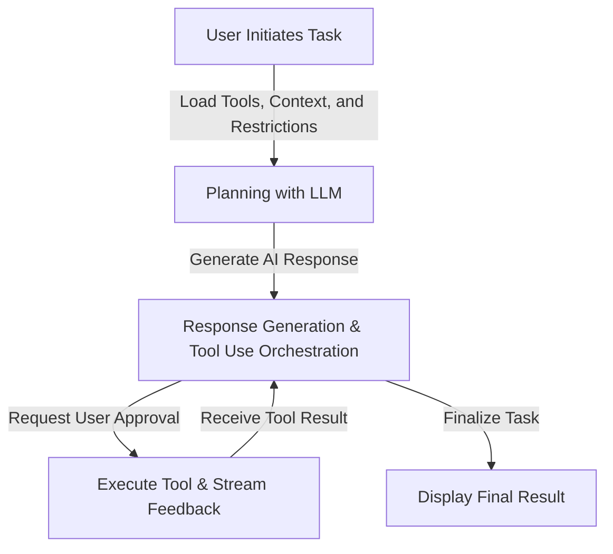

# Understanding the Agent Flow in a VS Code Extension: A Deep Dive into Cline

## Introduction

Intelligent agents like **Cursor Composer** and **WindSurf Cascade** are revolutionizing the in-IDE AI-assisted development landscape by automating complex tasks and enhancing developer productivity. However, leveraging these agents effectively requires overcoming significant challenges:

- **Domain Knowledge and Understanding**: These agents necessitate intricate domain knowledge and a nuanced understanding to operate effectively within specialized contexts.
- **Testing and Interpretability**: The absence of comprehensive testing capabilities and limited interpretability complicates the development process. Thoroughly testing an agent is challenging, and when issues arise, pinpointing the root cause is difficult due to the black-box nature of many AI models.
- **Pitfalls and Loops**: A single agent can easily encounter pitfalls, such as coding bugs or poor search results, leading it to loop within a single step for extended periods without considering the overall workflow, thus hindering smooth task progression.
- **Steering and Rule Enforcement**: Steering the agent or enforcing adherence to a complex set of rules and goals is problematic, as their decision-making processes may not be easily manipulated or controlled to align with desired outcomes.

In our experiment, we customized the open-source **Cline** framework to create a specialized Financial Advisory Agent. This endeavor exposed critical pain points and provided valuable insights into optimizing agent performance and reliability. This blog post details our technical journey, the solutions we implemented, and the lessons learned from enhancing Cline for this specialized task.

## Agent Flow Overview

### How the Flow Works
The agent flow within our VS Code extension is meticulously managed by the Cline class, which acts as the intermediary between the user, the LLM, and the array of integrated tools. The process is structured into a continuous loop as outlined below:


- **Task Start**: The user initiates a task through the extension interface. The Cline class captures this input and initializes the environment by loading the necessary tools, contextual data, and operational constraints.
- **Planning with LLM**: The Cline class forwards the task details to the LLM, prompting it to develop a strategic plan. This plan identifies the tools required and sequences the actions needed to achieve the task goals.
- **Response Generation & Tool Use Orchestration**: This is the core of the agent flow, and starting point of the agent's run loop. The LLM generates a detailed response outlining the selected tools and the steps for their execution. This response serves as a coordination point for the agent's subsequent actions, and keeps the flow moving forward.
- **User Approval**: Before proceeding, the agent seeks user approval (if not pre-approved) for the planned tool usage. This step ensures that the agent's approach aligns with the user's expectations and requirements.
- **Executing Tools and Streaming Results**: With approval granted, the agent executes the chosen tools. As tools operate, they provide real-time feedback and results, which are streamed back to the LLM for continuous analysis.
- **Result Assessment**: The LLM evaluates the feedback from the tools to determine the effectiveness of the actions taken. Based on this assessment, it decides whether additional steps are necessary, perpetuating the interaction loop.
- **Task Completion**: Once the LLM confirms that all objectives have been met, the agent finalizes the task and presents the aggregated results to the user, concluding the workflow.

### Tool Use
Tool usage is executed through a structured XML-style syntax, ensuring consistency and ease of parsing. Each tool serves a specific function, such as executing CLI commands, reading and writing files, conducting web searches, or fetching financial data.

**Example of Tool Invocation:**
```xml
<execute_command>
    <command>npm install axios</command>
</execute_command>
```

This methodical approach allows the agent to interact seamlessly with various tools, enabling precise and efficient task completion.

### Multi-round Self-planning

The agent employs an iterative self-planning process to ensure tasks are executed methodically and efficiently. This process is essential for maintaining progress, addressing issues promptly, and successfully completing tasks. The orchestration of this loop is primarily managed by the Large Language Model (LLM), guided by the system prompts defined in `system.ts` and the response handlers in `responses.ts`.

#### Loop Mechanism

1. **LLM Assessment and Decision-making**
    - **Prompt-Driven Analysis**: The `SYSTEM_PROMPT` in `system.ts` provides the LLM with detailed instructions on interpreting tool feedback and determining subsequent actions. This includes:
        - Assessing whether the tool execution was successful.
        - Deciding if additional tool executions are necessary.
        - Determining when the task has been completed.

    - **Decision-making Process**: Based on the formatted feedback from `responses.ts`, the LLM evaluates the outcome of the tool execution. If the tool succeeded, the LLM determines whether further actions are needed or if the task is complete. If the tool failed, the LLM decides whether to retry, choose a different tool, or escalate the issue.

2. **Continuous Loop Execution**
    - **Iterative Processing**: The agent continuously loops through the following steps:
        1. **Plan**: Using the LLM, the agent develops a strategic plan based on the current state and tool feedback.
        2. **Execute**: Executes the next tool in the plan.
        3. **Feedback**: Receives and processes feedback from the tool execution.
        4. **Assess**: LLM assesses the feedback and decides on the next action.

    - **Error Handling**: `responses.ts` provides standardized error messages and feedback formats, enabling the LLM to handle errors gracefully and make informed decisions about replanning.

    **Sequence Diagram:**
    ```mermaid
    sequenceDiagram
        participant User
        participant LLM
        participant Tool
        User->>LLM: Initiate Task
        loop Self-planning
            LLM->>LLM: Planning
            LLM->>Tool: Tool Use Instructions
            Tool->>LLM: Tool Use Result
            LLM->>User: Provide Update
        end
        LLM->>User: Final Result
    ```
        
3. **Task Completion**
    - **Final Assessment**: When the LLM determines that all task objectives have been met, it uses the `attempt_completion` tool to finalize the task and present the results to the user.
    - **Structured Final Response**: The `responses.ts` module ensures that the final output is well-formatted and comprehensive, avoiding any prompts for further interaction unless necessary.
    
    **Example Completion Invocation:**
    ```xml
    <attempt_completion>
        <result>
            The financial advisory report has been successfully generated and is available at src/data/report.html.
        </result>
        <command>open src/data/report.html</command>
    </attempt_completion>
    ```

#### Role of `system.ts` and `responses.ts` in the Loop

- **`system.ts` (System Prompts)**:
    - Defines the `SYSTEM_PROMPT` that provides the LLM with detailed instructions on tool usage, formatting, and execution guidelines.
    - Ensures the LLM understands how to interpret and execute tool commands, manage tool outputs, and adhere to operational constraints.
    
- **`responses.ts` (Response Handlers)**:
    - Formats the feedback received from tool executions, making it consistent and easy for the LLM to interpret.
    - Handles various response scenarios, including successful tool results, tool denials, and errors.
    - Facilitates the LLM's decision-making by providing structured and clear feedback, enabling effective replanning and task progression.

    **Example Response Handling in `responses.ts`:**
    ```typescript
    export const formatResponse = {
        toolDenied: () => `The user denied this operation.`,

        toolDeniedWithFeedback: (feedback?: string) =>
            `The user denied this operation and provided the following feedback:\n<feedback>\n${feedback}\n</feedback>`,

        toolError: (error?: string) => `The tool execution failed with the following error:\n<error>\n${error}\n</error>`,

        toolResult: (text: string, images?: string[]): string | Array<Anthropic.TextBlockParam | Anthropic.ImageBlockParam> => {
            ...
        },
        ...
    };
    ```
    
    - **Error Management**: Standardized responses for tool denials and errors enable the LLM to identify issues quickly and decide on appropriate actions, such as retries or alternative tool usage.
    
    - **Result Formatting**: Consistent formatting of tool results ensures that the LLM can accurately assess the outcomes and determine the next steps in the task execution process.
    
    By leveraging the structured prompts in `system.ts` and the response handlers in `responses.ts`, the agent maintains a robust and adaptive self-planning loop. This integration ensures that each tool execution informs subsequent actions, allowing the agent to navigate complex tasks with efficiency and reliability.

## Building a Customized Agent with Cline

### Why Cline?

The **Cline** framework is ideal for building simple Agentic AI systems in local environments due to its:

- **Modular Design**:
  - Facilitates easy integration of AI components such as Machine Learning models and NLP tools.
- **Flexibility**:
  - Allows developers to customize and extend the framework to meet specific project requirements.

**Key Features:**

- **Tool Management**:
  - Efficiently registers and executes necessary tools, enabling agents to handle complex tasks with minimal human intervention.
- **Environment Initialization**:
  - Supports the setup of essential APIs and services, ensuring efficient operation within local setups.

**Continuous Loop Self-Planning:**

- **Iterative Process**:
  - The loop mechanism allows agents to plan, execute, assess, and adjust actions continuously.
- **Responsiveness**:
  - Enables agents to remain adaptable to dynamic inputs and evolving tasks.

**Benefits:**

- **Focus on Intelligence**:
  - Empowers developers to enhance agent intelligence and performance without being bogged down by system complexities.
- **Autonomous Goal Setting**:
  - Allows agents to set and pursue their own goals, managing multiple responsibilities autonomously.

Cline's comprehensive capabilities make it a robust choice for developing efficient and reliable Agentic AI systems.


### Limitations

While Cline provides a robust foundation for developing Agentic AI systems, it does exhibit certain limitations that are important to acknowledge. Firstly, Cline operates using a single run loop, which restricts its ability to manage multiple agents concurrently. This single-loop architecture means that only one agent can be actively performing tasks at any given time, potentially creating bottlenecks in environments that require parallel processing or multitasking capabilities. Additionally, the current design supports only a single agent system, limiting scalability and the complexity of operations that can be handled effectively.

Another significant limitation is the handling of long-running tasks or operations that require persistent state management. The single run loop may struggle with maintaining context over extended periods, leading to potential loss of information or context drift. Furthermore, Cline's current tool management system, while effective for basic operations, may require enhancements to support more complex tool interactions and dependencies, especially as the demands of Agentic AI systems grow. Addressing these limitations would necessitate architectural changes, such as introducing multi-threading capabilities or expanding the framework to support distributed agent architectures, to fully harness the potential of Agentic AI in more demanding and dynamic environments.

### Customization Needs for Implementing a Simple Agentic AI System with Cline

Implementing a simple Agentic AI system with Cline requires specific customizations to effectively manage tool use and enhance system capabilities. Firstly, extending Cline's tool registry is essential to accommodate a broader range of tools tailored to the tasks at hand. This involves defining new tool interfaces, ensuring seamless integration with existing tools, and establishing protocols for tool invocation and result handling. By expanding the tool registry, the agent gains access to diverse functionalities, enabling it to perform complex tasks autonomously and adapt to varying operational requirements.

Additionally, enhancing the tool management framework to support dynamic tool configuration and execution is crucial. This includes implementing robust mechanisms for tool discovery, registration, and dependency management, allowing the agent to select and utilize appropriate tools based on contextual needs and goal priorities. Incorporating advanced features such as tool chaining, where the output of one tool serves as the input for another, can significantly improve task efficiency and outcome quality. Furthermore, developing comprehensive error-handling strategies and feedback loops ensures that the agent can gracefully manage tool failures, retry mechanisms, and alternative tool selection, thereby enhancing overall system resilience and reliability.

#### Enhancements Implemented

1. **Steerable System Prompt**
    - **Streamlining Prompt Content**: By refining the system prompt, we significantly reduced its size by 80%, ensuring that the LLM focused on relevant instructions without being overwhelmed by verbosity.
    - **Clear and Structured Language**: Using precise language and organizing the prompt into well-defined sections improved readability and effectiveness. For example, replacing vague instructions like “follow standard practices” with specific directives such as “Use GAAP standards for financial projections.”
    - **Improved Formatting**: Incorporating titles, separation lines, and grouping related rules enhanced the prompt’s clarity, making it easier for the LLM to follow and reference specific guidelines.

2. **Improved Planning and Progress Logging**
    - **Introduction of `.planning` File**: We implemented a `.planning` file to systematically track progress and log task execution. This allows the agent to maintain focus over long tasks, prevents it from losing track, and enables dynamic plan adjustments if a step fails or encounters an infinite loop.
    - **Structured Planning**: At the outset of a task, the system creates a structured plan outlining key milestones, dependencies, and expected outputs.
    - **Progress Logging**: The agent logs its progress continuously, ensuring that the context remains focused and accessible for revisiting earlier plans as needed.

3. **Knowledge File for Contextual Guidance**
    - **Supplementary Context**: Introducing a knowledge file provided the agent with general guidance, enabling context-aware decision-making without imposing rigid rules. This fosters creative and informed responses based on domain expertise.
    - **Guidance Over Strict Rules**: Differentiating between hard constraints (rules) and soft guidance (knowledge) allows the agent to make nuanced decisions aligned with best practices while maintaining flexibility.

4. **Learned Lessons File for Continuous Improvement**
    - **Documentation of Errors and Resolutions**: Implementing a learned lessons file enabled the agent to document mistakes and their resolutions. This feature is crucial for continuous improvement, allowing the agent to reference past errors to avoid repeating them in future tasks.
    - **Self-improvement Mechanism**: By maintaining a log of lessons learned, the agent can autonomously refine its processes and enhance reliability over time.

### Lessons Learned

Our experience developing a financial advisory agent with Cline underscored several important insights:

- **Streamlined System Prompt**: Reducing the system prompt’s length improved the LLM’s focus and efficiency, eliminating confusion caused by excessive instructions.
- **Structured Planning and Logging**: The `.planning` file provided a disciplined approach to task execution, ensuring that the agent remained on track and could recover from errors effectively.
- **Knowledge and Reflection**: Supplementing strict rules with contextual knowledge and a reflection mechanism enhanced the agent’s adaptability and decision-making capabilities.
- **Continuous Learning**: The learned lessons file proved invaluable for enabling the agent to self-improve, documenting errors, and ensuring that recurring mistakes were systematically addressed.

Building a financial advisory agent in Cline was a transformative experience. By focusing on concise prompting, structured planning, and continuous learning, we created a system capable of performing complex tasks autonomously while evolving with experience. These insights may inspire similar endeavors in developing specialized single-agent AI systems.
